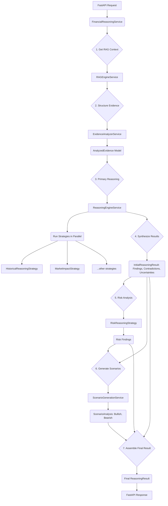

# Financial Reasoning Engine

This module contains the core intelligence layer of the Market Intelligence Platform. It is responsible for taking the structured evidence gathered by the RAG Context Builder and performing a multi-layered analysis to generate evidence-based insights, scenarios, and risk assessments.

## Architecture

The engine follows the Clean Architecture and Strategy patterns established throughout the platform. It is composed of several key services that work in concert in a multi-pass pipeline.

### Key Components

1.  **`FinancialReasoningService`**: The top-level orchestrator. It manages the end-to-end flow from receiving a query to returning a complete `ReasoningResult`.

2.  **`EvidenceAnalyzerService`**: A crucial pre-processing step. It takes the heterogeneous list of `RetrievedItem` objects from the `RAGContext` and transforms it into a strongly-typed `AnalyzedEvidence` model. This simplifies the logic for all downstream strategies.

3.  **`ReasoningStrategy` (Abstract Base Class)**: Defines the interface for all reasoning strategies. This allows for modular, independent "expert" components that each analyze the evidence from a specific perspective.

4.  **Concrete Strategies** (`HistoricalReasoningStrategy`, `MarketImpactStrategy`, etc.): Each class implements a specific type of analysis. For example, `HistoricalReasoningStrategy` looks for parallels in past events, while `MarketImpactStrategy` infers potential market movements.

5.  **`ReasoningEngineService`**: The composite engine for the primary reasoning pass. It runs all registered strategies (except risk) in parallel and then synthesizes their findings to identify high-level `contradictions` and `uncertainties`.

6.  **`RiskReasoningStrategy`**: A special strategy that runs in a second pass. It analyzes both the initial evidence and the results of the primary reasoning pass (including the detected uncertainties and contradictions) to generate a dedicated list of `risks`.

7.  **`ScenarioGenerationService`**: The final step in the pipeline. It uses an LLM to synthesize the findings and contradictions into coherent, evidence-backed narratives for bullish, bearish, and base-case scenarios.

### Explainability

A core principle of this engine is **zero hallucination**. Every conclusion must be traceable to the evidence provided by the RAG engine. This is enforced through two key mechanisms:

-   **`EvidenceSource`**: Every `Finding` object contains a list of `EvidenceSource` items that directly support its conclusion.
-   **`reasoning_chain`**: Every `Finding` also contains a human-readable, step-by-step explanation of the logical process the strategy followed to arrive at its conclusion from the evidence.

This ensures that every piece of output from the engine is transparent and auditable.